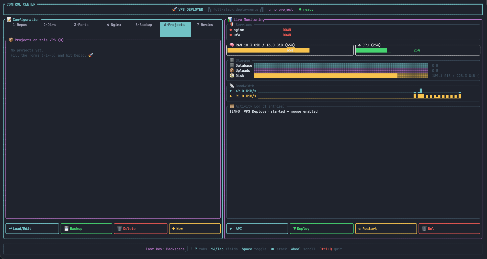

<p align="center">
  
  
  
  
</p>

<h1 align="center">🚀 vps-deployer (Use it carefully; Developed by AI)</h1>

<p align="center">
  <b>A mouse-friendly terminal UI that deploys full-stack apps to your Linux VPS —<br>
  git clone, systemd, nginx, HTTPS (certbot), UFW, backups and live monitoring, all from one screen.</b>
</p>



## ✨ Features

**Deployment**
- 🧩 Form-driven setup split into focused tabs: **Repos · Dirs · Ports · Nginx · Backup · Projects · Review**
- 🔧 Backend stack selector — **Node.js, TypeScript, Rust, Go, Python** — automatically sets the build command *and* the systemd `ExecStart`
- 📦 Clones backend and/or frontend repos (either is optional) on your chosen branch
- 🛠 Generates **editable staged files** you can review and `vim` before installing:
  `deploy.sh`, `<name>-backend.service`, `nginx-<domain>.conf`, `backup.sh`
- 📥 **"Deploy (my edits)"** installs the files exactly as you edited them
- 🔒 HTTPS via **certbot** (Let's Encrypt), nginx reverse proxy with WebSocket support
- 🧱 **UFW** rules applied automatically (web, backend port, extras)
- 🗑 One-button **complete removal** — service, vhost, cert, firewall rules, dirs, config (with double-confirm)

**Operations**
- 📜 Generated `deploy.sh` — pulls the production branch next to the frontend/backend dirs, builds both, restarts everything
- 💾 **Backups**: snapshot script with retention policy + optional daily 03:00 cron + "Backup Now" button + restore guide
- 📖 **"Get docs"** — generates a complete `DOCUMENTATION.md` of *your* server setup: what is where, how it works, commands, troubleshooting
- 📚 **Multi-project**: every deployment is saved; list, load, edit, back up, or delete any project

**Live monitoring (right panel)**
- 🛡 Service status (systemd + nginx + UFW + API health) with color indicators
- 🧠 RAM & ⚙ CPU gauges · 🗄 DB / Uploads / Disk storage bars · 📡 rx/tx bandwidth sparklines
- 📜 Scrollable activity log · toast notifications · mouse support everywhere
- 🔤 Auto-detects UTF-8 capability — offers to install locale/font packages or falls back to ASCII mode

## 🔄 How it works

```text
 Forms (F1–F5) ──▶ Staged files in <dir>/.vps-deployer/ ──▶ Review (F7)
                        │   deploy.sh                            │
                        │   <name>-backend.service   ◀── edit with vim (optional)
                        │   nginx-<domain>.conf                  │
                        │   backup.sh                            ▼
                        └────────────────────────▶ 🚀 Deploy / 📥 Deploy (my edits)
                                                       │
                     ┌─────────────────────────────────┼─────────────────────────┐
                     ▼                                 ▼                         ▼
             systemd unit installed          nginx vhost + certbot          UFW rules
             enabled + started               installed + reloaded           + cron backup
```

## ✅ Requirements

| Requirement | Notes |
|---|---|
| Linux VPS | Debian/Ubuntu recommended (uses `apt` for the font/locale fix) |
| `git`, `nginx`, `certbot`, `ufw`, `systemd` | `sudo apt install git nginx certbot python3-certbot-nginx ufw` |
| Root / sudo | the TUI writes to `/etc/systemd/system`, `/etc/nginx`, firewall |
| Terminal | any terminal with UTF-8 recommended (ASCII fallback built in) |

## 📦 Installation

**Option A — build on the VPS (simplest)**

```bash
curl --proto '=https' --tlsv1.2 -sSf https://sh.rustup.rs | sh -s -- -y
source $HOME/.cargo/env
git clone https://github.com/Milad-HajiShafiei/vps-deployer && cd vps-deployer
cargo build --release
sudo cp target/release/vps-deployer /usr/local/bin/
```

**Option B — prebuilt binary from GitHub Releases**

```bash
uname -m   # x86_64 or aarch64
curl -fsSL https://github.com/Milad-HajiShafiei/vps-deployer/releases/latest/download/vps-deployer-x86_64.tar.gz | tar xz
sudo mv vps-deployer /usr/local/bin/ && sudo chmod +x /usr/local/bin/vps-deployer
```

**Option C — crates.io**

```bash
cargo install vps-deployer
```

> Run it with: `sudo vps-deployer`

## 🚀 Quick start

1. **Launch**: `sudo vps-deployer`
2. **F1 Repos** — project name, backend stack (◀ ▶), repo URLs, branch
3. **F2 Dirs** — deploy directory, database & uploads paths
4. **F3 Ports** — backend port, health path, firewall toggles
5. **F4 Nginx** — domain + certbot email (leave empty to skip nginx/SSL)
6. **F5 Backup** — retention, contents, daily cron
7. **F7 Review** — check the summary, then:
   - **🚀 Deploy** — generate everything and install it
   - **📜 Files only** — write staged files so you can `vim` them first, then **📥 My edits**
8. Watch the right panel: services go green, gauges start moving 🎉

## ⌨️ Keyboard & mouse

| Key | Action |
|---|---|
| `1–7` / `F1–F7` / `PgUp` `PgDn` | switch tabs |
| `↑ ↓` / `Tab` | move between fields |
| `Space` / `Enter` | toggle switches |
| `◀ ▶` | change backend stack |
| `Enter` (Review) | deploy |
| `e` / `w` / `g` (Review) | deploy my edits · write files · get docs |
| `j k` `b` `d` `n` (Projects) | navigate · backup · delete · new |
| Mouse wheel | scroll activity log |
| `Ctrl+Q` | quit |

Everything is also clickable — tabs, fields, toggles, project rows and buttons.

## 🗂 What gets installed on your server

```text
/var/www/myapp/                      ← your deploy directory
├── backend/                         ← cloned backend repo
├── frontend/                        ← cloned frontend repo
├── deploy.sh                        ← production deploy script
└── .vps-deployer/                   ← staged, vim-editable files
    ├── deploy.sh
    ├── myapp-backend.service
    ├── nginx-example.com.conf
    ├── backup.sh
    └── DOCUMENTATION.md             ← generated by 📖 Docs

/etc/systemd/system/myapp-backend.service
/etc/nginx/sites-available/example.com  (+ sites-enabled symlink)
/etc/letsencrypt/live/example.com/      (certbot)
~/.config/vps-deployer/projects/        (project configs, one JSON per project)
```

## 🔁 Daily operations

```bash
cd /var/www/myapp && ./deploy.sh        # pull production + build + restart
sudo systemctl status myapp-backend     # service health
sudo journalctl -u myapp-backend -f     # live backend logs
bash /var/www/myapp/.vps-deployer/backup.sh   # manual backup
```

…or use the right-panel buttons: **⚡ API** (health check), **▼ Deploy** (runs deploy.sh), **↻ Restart**, **🗑 Del**.

## 🧯 Troubleshooting

| Symptom | Fix |
|---|---|
| 502 Bad Gateway | backend service down or wrong port → check **🛡 Services** panel |
| Cert warning | `sudo certbot renew` |
| Icons look broken | restart the TUI → it offers to install `locales`/fonts, or press `c` for ASCII mode |
| F-keys don't work | laptop media keys — use `Fn+F…` or plain number keys `1–7` |
| Permission errors | always run with `sudo` |

## 🏗 Project structure

```text
src/
├── main.rs        # entry point, terminal setup, event loop, panic-safe cleanup
├── app.rs         # state: tabs, form fields, messages
├── config.rs      # project model, stacks, validation, per-project persistence
├── templates.rs   # renders template files with project values
├── actions.rs     # deploy, install, delete, backup, UFW, health checks
├── docs.rs        # 📖 DOCUMENTATION.md generator
├── monitor.rs     # background metrics (RAM/CPU/net/disk/services)
├── input.rs       # keyboard + mouse handling, action dispatch
├── theme.rs       # colors, unicode/ascii icon sets, UTF-8 detection
└── ui/            # layout, forms, projects list, monitoring panels
templates/         # deploy.sh.tpl, backend.service.tpl, nginx.conf.tpl,
                   # backup.sh.tpl, documentation.md.tpl
```

## 🛣 Roadmap

- Docker / docker-compose deployment mode
- Zero-downtime deploys (blue/green)
- Remote deploy to multiple VPSs over SSH
- Log tailing from the journal inside the TUI

## 📄 License

MIT — see [LICENSE](LICENSE).
